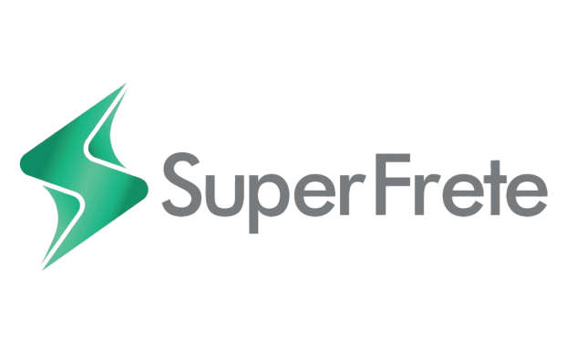

# Berdsk.Sdk.SuperFrete



**Berdsk.Sdk.SuperFrete** é um SDK .NET não oficial, desenvolvido pela **Berdsk**, para integração com a API da [SuperFrete](https://superfrete.com/). Construído com tipagem forte, 100% `System.Text.Json` e estrutura otimizada para uso com ferramentas de IA (LLMs).

[](https://www.nuget.org/packages/Berdsk.Sdk.SuperFrete)
[](https://docs.microsoft.com/dotnet/standard/net-standard)
[](LICENSE)

---

## Recursos

- **Cálculo de Frete** — Cotar PAC, SEDEX, Jadlog, Mini Envios e Loggi em uma chamada.
- **Gestão de Carrinho** — Adicionar envios ao carrinho com remetente, destinatário, volumes e opções.
- **Checkout** — Pagar etiquetas com saldo da conta SuperFrete.
- **Gestão de Pedidos** — Consultar, cancelar, reimprimir e listar pedidos com paginação.
- **Webhooks** — CRUD de apps de webhook com validação de assinatura HMAC-SHA256.
- **Usuários** — Consultar saldo, dados do perfil e endereços cadastrados.
- **Tipagem Forte** — Todos os retornos são DTOs tipados. Zero uso de `dynamic`.
- **Sem Magic Strings** — Helpers estáticos para status, eventos e serviços.

---

## Instalação

```bash
dotnet add package Berdsk.Sdk.SuperFrete
```

---

## Configuração Inicial

```csharp
using Berdsk.Sdk.SuperFrete;
using Berdsk.Sdk.SuperFrete.Helpers;

var client = new SuperFreteClient(
    token: "SEU_TOKEN_AQUI",
    environment: SuperFreteEnvironment.Sandbox, // ou Production
    appName: "MinhaApp",
    appVersion: "1.0.0",
    contactEmail: "contato@meudominio.com"
);
```

> **Token:** Gere em [Produção](https://web.superfrete.com/#/integrations) ou [Sandbox](https://sandbox.superfrete.com/#/integrations).

### Com Injeção de Dependência (ASP.NET Core)

```csharp
// Program.cs
builder.Services.AddSingleton<SuperFreteClient>(sp =>
{
    var config = sp.GetRequiredService<IConfiguration>();
    return new SuperFreteClient(
        token: config["SuperFrete:Token"]!,
        environment: SuperFreteEnvironment.Production,
        appName: "MinhaApp",
        appVersion: "1.0.0",
        contactEmail: config["SuperFrete:ContactEmail"]!
    );
});
```

---

## Exemplos de Uso

### Calcular Frete

```csharp
using Berdsk.Sdk.SuperFrete.Helpers;
using Berdsk.Sdk.SuperFrete.Services.Calculator.Dtos;

var cotacoes = await client.Calculator.CalculateShippingAsync(new SfCalculateShippingRequest
{
    From = new SfCalculationOriginRequest { PostalCode = "01310100" },
    To = new SfCalculationDestinationRequest { PostalCode = "20040020" },
    Services = [SfShippingServiceType.Pac, SfShippingServiceType.Sedex, SfShippingServiceType.Jadlog],
    Package = new SfCalculationPackageRequest { Height = 15, Width = 15, Length = 20, Weight = 0.5 }
});

foreach (var servico in cotacoes?.Where(c => !c.HasError) ?? [])
{
    Console.WriteLine($"{servico.Name}: R$ {servico.Price:F2} — {servico.DeliveryTime} dias úteis");
}
```

### Criar Etiqueta (Fluxo Completo)

```csharp
// 1. Adicionar ao carrinho
var pedido = await client.Cart.AddToCartAsync(new SfAddToCartRequest
{
    From = new SfCartSenderRequest
    {
        Name = "Loja Exemplo",
        PostalCode = "01310100",
        Address = "Av. Paulista",
        Number = "1000",
        District = "Bela Vista",
        City = "São Paulo",
        StateAbbr = "SP"
    },
    To = new SfCartRecipientRequest
    {
        Name = "João da Silva",
        PostalCode = "20040020",
        Address = "Rua da Assembleia",
        Number = "10",
        District = "Centro",
        City = "Rio de Janeiro",
        StateAbbr = "RJ",
        Document = "98765432100"
    },
    Service = (int)SfShippingServiceType.Pac, // ID do serviço escolhido
    Volumes = [new SfCartVolumeRequest { Height = 15, Width = 15, Length = 20, Weight = 0.5 }],
    Platform = "MinhaLoja/1.0.0"
});

// 2. Pagar com saldo (gera a etiqueta)
var checkout = await client.Checkout.FinalizeOrderAsync(new SfCheckoutRequest
{
    Orders = [pedido!.Id!]
});

var etiqueta = checkout?.Purchase?.Orders?.FirstOrDefault();
Console.WriteLine($"Rastreio: {etiqueta?.Tracking}");
Console.WriteLine($"Imprimir: {etiqueta?.Print?.Url}");
```

### Listar Pedidos

```csharp
var lista = await client.Orders.ListOrdersAsync(new SfListOrdersRequest
{
    Status = SfOrderStatus.Posted,
    Page = 1,
    PerPage = 20,
    Order = SfSortOrder.Descending,
    SortBy = SfSortBy.CreatedAt
});

Console.WriteLine($"Total: {lista?.Total} pedidos postados");
```

### Gerenciar Webhooks

```csharp
// Criar webhook
var webhook = await client.Webhooks.CreateWebhookAsync(new SfCreateWebhookRequest
{
    Name = "Notificações",
    Url = "https://meusite.com/webhooks/superfrete",
    Events = [SfWebhookEvent.OrderPosted, SfWebhookEvent.OrderDelivered]
});

// IMPORTANTE: Guarde o SecretToken — só é retornado na criação!
Console.WriteLine($"Secret: {webhook?.SecretToken}");
```

### Tratamento de Erros

```csharp
try
{
    var resultado = await client.Cart.AddToCartAsync(request);
}
catch (SfBadRequestException ex)
{
    Console.WriteLine($"Dados inválidos: {ex.ErrorResponse?.Message}");
}
catch (SfUnauthorizedException)
{
    Console.WriteLine("Token inválido. Gere um novo token.");
}
catch (SfTooManyRequestsException)
{
    Console.WriteLine("Rate limit atingido. Aguarde e tente novamente.");
}
catch (SuperFreteException ex)
{
    Console.WriteLine($"Erro [{(int)ex.StatusCode}]: {ex.Message}");
}
```

---

## Mapa de Serviços

| Propriedade | Interface | Responsabilidade |
| :--- | :--- | :--- |
| `client.Calculator` | `ISfCalculatorService` | Cotação de fretes |
| `client.ShippingServices` | `ISfShippingServicesService` | Info técnica das transportadoras |
| `client.Cart` | `ISfCartService` | Adicionar envios ao carrinho |
| `client.Checkout` | `ISfCheckoutService` | Pagar etiquetas com saldo |
| `client.Orders` | `ISfOrderService` | Gestão de pedidos |
| `client.Webhooks` | `ISfWebhookService` | CRUD de webhooks |
| `client.Users` | `ISfUserService` | Dados do usuário e saldo |

---

## Documentação Completa

A documentação detalhada com exemplos para cada serviço está em [`claude-skill/`](./claude-skill/):

| Arquivo | Conteúdo |
| :--- | :--- |
| [SKILL.md](./claude-skill/SKILL.md) | Índice da skill — ponto de entrada para LLMs |
| [00-comece-aqui.md](./claude-skill/00-comece-aqui.md) | Guia de início rápido e FAQ |
| [01-superfrete-client.md](./claude-skill/01-superfrete-client.md) | Configuração e DI |
| [02-calculator.md](./claude-skill/02-calculator.md) | Cotação de fretes |
| [03-cart.md](./claude-skill/03-cart.md) | Adicionar ao carrinho |
| [04-checkout.md](./claude-skill/04-checkout.md) | Pagar etiquetas |
| [05-orders.md](./claude-skill/05-orders.md) | Gestão de pedidos |
| [06-webhooks.md](./claude-skill/06-webhooks.md) | Webhooks e HMAC |
| [07-users.md](./claude-skill/07-users.md) | Dados do usuário |
| [08-shipping-services.md](./claude-skill/08-shipping-services.md) | Info das transportadoras |
| [09-helpers.md](./claude-skill/09-helpers.md) | Helpers e constantes |
| [10-exceptions.md](./claude-skill/10-exceptions.md) | Tratamento de erros |

Para consumo por LLMs, consulte [llms.txt](./llms.txt).

---

## Requisitos

- .NET Standard 2.1+
- .NET 6 / 7 / 8 / 9 (para aplicações)

---

## Licença

Este projeto está licenciado sob a [Licença MIT](LICENSE).

---

## Sobre a Berdsk


A **Berdsk** foca em criar soluções tecnológicas eficientes e SDKs de alta qualidade para o ecossistema .NET.

Visite: [berdsk.com.br](https://berdsk.com.br)

---

> **Aviso:** Esta é uma biblioteca independente e não possui vínculo oficial com a SuperFrete. Todos os direitos da marca SuperFrete pertencem aos seus respectivos proprietários.
